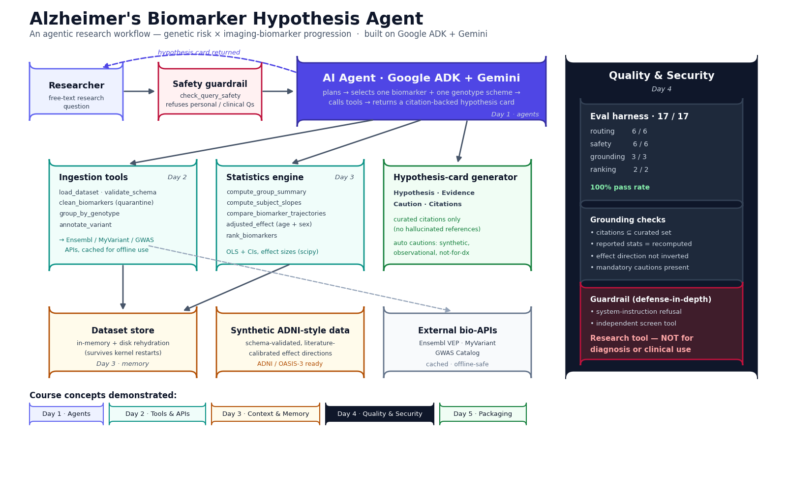

# Alzheimer's Biomarker Hypothesis Agent

An agentic research workflow that turns subject-level Alzheimer's biomarker data into
transparent, citation-backed, **hypothesis-generating** cards. Built on Google ADK +
Gemini for the *AI Agents: Intensive Vibe Coding* capstone.

> **Research / education tool — not for diagnosis or clinical use.** Every result is
> observational and hypothesis-generating. The included dataset is **synthetic** (see
> below); reported effects are built into the data generator by design, not evidence
> about real biology.



## What it does

A researcher asks a plain-language question (e.g. *"Do APOE ε4 carriers show higher
amyloid burden and faster hippocampal decline?"*). The agent screens the question for
safety, inspects the dataset, selects one biomarker and one genotype scheme, runs the
statistics, and returns a Hypothesis / Evidence / Caution / Citations card whose numbers
and references are all traceable to tool output.

## Repository layout

```
.
├── generate_synthetic_adni.py   # synthetic ADNI/OASIS-style data generator
├── synthetic_adni_style.csv     # demo dataset (synthetic, ADNI-ready schema)
├── DATA_DICTIONARY.md           # schema, units, calibration anchors, citations
├── ingestion.py                 # load / validate / clean / group / annotate tools
├── stats_engine.py              # group summaries, slopes, trajectories, adjusted effects, ranking, cards
├── agent.py                     # ADK/Gemini agent + tools + guardrail + deterministic core
├── evals.py                     # routing / safety / grounding / ranking eval harness
├── eval_results.json            # latest eval scorecard (17/17)
├── docs/architecture_diagram.*  # architecture diagram (PNG + SVG) and its render script
├── requirements.txt
└── .gitignore
```

## Setup

```bash
python -m venv .venv
source .venv/bin/activate        # Windows: .venv\Scripts\activate
pip install -r requirements.txt
```

## Quickstart

```bash
# 1. (re)generate the synthetic dataset
python generate_synthetic_adni.py --n 300 --seed 42 --out synthetic_adni_style.csv

# 2. run the evaluation harness (no API key needed — scores the deterministic core)
python evals.py

# 3. try the deterministic agent core interactively
python agent.py --csv synthetic_adni_style.csv
```

To run the **Gemini** agent, install `google-adk`, set your Gemini credentials, then
launch `adk web` (or `adk run`) pointed at `agent.py`'s `root_agent`. See the runner
snippet in the `agent.py` docstring for driving it with a stable session so follow-up
questions keep context.

## How it maps to the course

- **Day 1 — Agents:** ADK + Gemini orchestrator that plans and calls tools.
- **Day 2 — Tools & interoperability:** Python-function tools; variant annotation via
  Ensembl / MyVariant / GWAS Catalog with an offline-safe cache.
- **Day 3 — Context & memory:** in-memory dataset store with disk rehydration; session
  follow-ups.
- **Day 4 — Quality & security:** eval harness (routing, safety, grounding, ranking) and
  a defense-in-depth clinical-question guardrail.
- **Day 5 — Packaging:** this repo, the notebook, and the architecture diagram.

## Data note

The demo data is synthetic but matches an ADNI/OASIS-style schema and is calibrated to
literature-consistent effect directions (APOE ε4 → higher amyloid, faster hippocampal
decline; TREM2 R47H ≈ one ε4 allele). The pipeline is **ADNI/OASIS-3 ready**: point it at
approved, access-controlled real data with the same columns to run the real analysis.
See `DATA_DICTIONARY.md`.

## Limitations & ethics

Observational associations only, no causal claims. Per-subject OLS slopes approximate a
linear mixed-effects model (the confirmatory upgrade). Rare variants (TREM2) are
underpowered. Citations come from a curated set so they are always verifiable. The agent
refuses individual diagnosis, prognosis, treatment, and personal-risk questions.

## License

This project is licensed under the MIT License - see the LICENSE.md file for details
